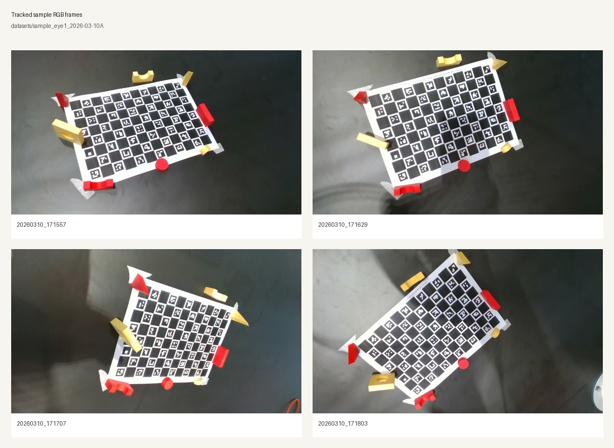
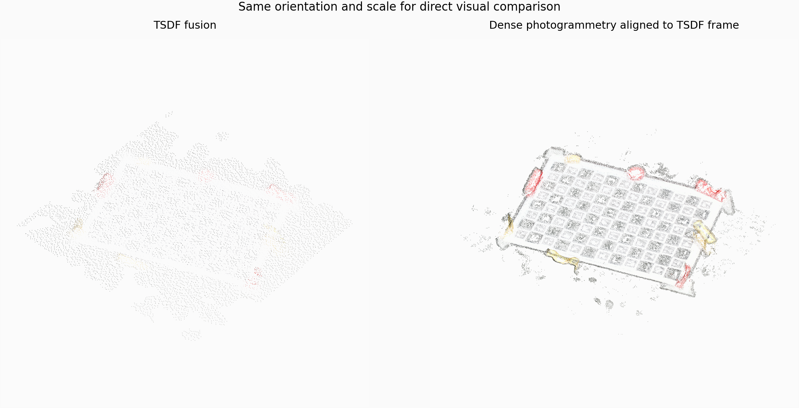

# 3Dstitch

`3Dstitch` is a small, self-contained reconstruction workspace for comparing two ways of turning a short RGB-D wrist-camera scan into 3D geometry:

1. A depth-anchored reconstruction path that detects ArUco markers, recovers camera motion from repeated 3D marker corners, and fuses the frames into an Open3D TSDF volume.
2. A pure-RGB photogrammetry path that runs pycolmap/COLMAP sparse reconstruction and optional dense stereo on the same image set.

The repository also contains browser-side inspection tools that export static JSON manifests and render:

- a raw recording viewer,
- a fused reconstruction viewer,
- a photogrammetry viewer using the same reconstruction page,
- and a comparison viewer that aligns the photogrammetry output into the TSDF frame.

This README is written as a handoff document for another computer vision engineer. It is intentionally explicit about the file contracts, execution flow, coordinate transforms, and current limitations.

## Visual overview

Four representative RGB frames from the tracked sample recording:



Shared-view reconstruction previews generated locally from the sample dataset outputs. The photogrammetry cloud is aligned into the TSDF frame and both renders use the same orientation and scale:



## 1. Repository intent and current scope

The workspace is not a framework or library. It is a set of focused scripts built around one captured dataset:

- tracked input dataset: [`datasets/sample_eye1_2026-03-10A`](datasets/sample_eye1_2026-03-10A)
- dataset-specific notes: [`datasets/README.md`](datasets/README.md)
- generated TSDF outputs: `outputs/`
- generated photogrammetry outputs: `outputs_photogrammetry/`
- generated viewer manifests: `viewer_data/`

Version-control policy in this repository:

- the sample input dataset is tracked,
- generated outputs are not tracked,
- the local virtual environment is not tracked,
- reproducing the environment is done from documentation, not by committing `.venv`.

The code is designed for offline reconstruction and inspection, not for real-time operation. The current dataset looks like a RealSense-style recording where each timestamp has:

- an RGB image,
- an aligned depth map in meters,
- color and depth intrinsics,
- one or more camera pose/transform files,
- an optional point cloud dump from the acquisition system.

The project does not currently contain:

- automated tests,
- a packaging/build system,
- a dataset recorder,
- calibration scripts,
- a ROS integration layer,
- or a trained model component.

## 2. Repository layout

Top-level structure:

```text
3Dstitch/
├── README.md
├── requirements.txt
├── .gitignore
├── context-from-chatgpt.md
├── docs/
│   └── assets/
│       ├── sample_rgb_grid.jpg
│       └── reconstruction_comparison_preview.png
├── datasets/
│   ├── README.md
│   └── sample_eye1_2026-03-10A/
│       ├── image_<timestamp>.jpg
│       ├── aligned_depth_to_color_<timestamp>.npz
│       ├── color_camera_info_<timestamp>.json
│       ├── depth_camera_info_<timestamp>.json
│       ├── tf_<timestamp>.npz
│       ├── tf_color_<timestamp>.npz
│       ├── camera_pose_<timestamp>.json
│       └── cloud_<timestamp>.pcd
├── tools/
│   ├── aruco_depth_tsdf.py
│   ├── rgb_photogrammetry.py
│   ├── dense_photogrammetry.py
│   ├── export_recording_viewer.py
│   ├── export_reconstruction_viewer.py
│   ├── export_photogrammetry_viewer.py
│   ├── export_comparison_viewer.py
│   └── generate_readme_previews.py
├── outputs/
│   └── <dataset_name>/
│       ├── aruco_pose_summary.json
│       ├── tsdf_mesh.ply
│       └── tsdf_pointcloud.ply
├── outputs_photogrammetry/
│   └── <dataset_name>/
│       ├── database.db
│       ├── model/
│       ├── sparse/
│       ├── sparse_points.ply
│       ├── summary.json
│       ├── dense/
│       ├── dense_fused.ply
│       └── dense_poisson_mesh.ply
├── viewer/
│   ├── index.html
│   ├── reconstruction.html
│   └── compare.html
├── outputs/                     # generated, gitignored
├── outputs_photogrammetry/      # generated, gitignored
└── viewer_data/                 # generated, gitignored
```

What each source file does:

- [`tools/aruco_depth_tsdf.py`](tools/aruco_depth_tsdf.py): main RGB-D reconstruction path. Detects ArUco markers, back-projects marker corners into 3D, estimates per-frame poses relative to the first frame, then fuses TSDF geometry with Open3D.
- [`tools/rgb_photogrammetry.py`](tools/rgb_photogrammetry.py): sparse RGB-only reconstruction using pycolmap.
- [`tools/dense_photogrammetry.py`](tools/dense_photogrammetry.py): dense stereo plus optional Poisson meshing on top of the sparse pycolmap result.
- [`tools/export_recording_viewer.py`](tools/export_recording_viewer.py): converts a raw recording into per-frame JSON plus a manifest for [`viewer/index.html`](viewer/index.html).
- [`tools/export_reconstruction_viewer.py`](tools/export_reconstruction_viewer.py): exports the TSDF reconstruction and recovered camera trajectory into a viewer manifest.
- [`tools/export_photogrammetry_viewer.py`](tools/export_photogrammetry_viewer.py): exports sparse or dense photogrammetry geometry into the same reconstruction-viewer format.
- [`tools/export_comparison_viewer.py`](tools/export_comparison_viewer.py): aligns photogrammetry to TSDF and exports a combined comparison manifest.
- [`tools/generate_readme_previews.py`](tools/generate_readme_previews.py): regenerates the tracked README preview images from the sample dataset and the locally generated reconstruction outputs.
- [`viewer/index.html`](viewer/index.html): static recording inspector for RGB image, depth preview, and sampled point cloud.
- [`viewer/reconstruction.html`](viewer/reconstruction.html): static viewer for one reconstruction manifest.
- [`viewer/compare.html`](viewer/compare.html): static viewer for overlaid TSDF and photogrammetry results.
- [`context-from-chatgpt.md`](context-from-chatgpt.md): design notes and project history. It is not executed, but it explains the thinking that led to the current architecture.

## 3. Data model and naming contract

The code assumes a dataset folder whose files are keyed by the same timestamp suffix:

- `image_20260310_171557.jpg`
- `aligned_depth_to_color_20260310_171557.npz`
- `color_camera_info_20260310_171557.json`
- `depth_camera_info_20260310_171557.json`
- `tf_color_20260310_171557.npz`
- `tf_20260310_171557.npz`
- `camera_pose_20260310_171557.json`
- `cloud_20260310_171557.pcd`

### 3.1 Required files per pipeline

Required by the ArUco TSDF path:

- `image_<timestamp>.jpg`
- `aligned_depth_to_color_<timestamp>.npz`
- `color_camera_info_<timestamp>.json`

Required by sparse RGB photogrammetry:

- `image_<timestamp>.jpg`
- `color_camera_info_<timestamp>.json`

Required by the recording viewer exporter:

- `aligned_depth_to_color_<timestamp>.npz`
- `image_<timestamp>.jpg`
- `color_camera_info_<timestamp>.json`
- one of:
  - `tf_color_<timestamp>.npz`
  - `tf_<timestamp>.npz`
  - `camera_pose_<timestamp>.json`

### 3.2 Known file contents

Observed contents of one sample frame:

- [`color_camera_info_20260310_171557.json`](datasets/sample_eye1_2026-03-10A/color_camera_info_20260310_171557.json)
  - width: `848`
  - height: `480`
  - `fx`, `fy`, `cx`, `cy`
  - ROS-style camera matrices `k`, `d`, `r`, `p`
  - timestamp metadata
- `aligned_depth_to_color_*.npz`
  - key: `depth`
  - shape: `(480, 848)`
  - dtype: `float32`
  - units: meters
- `tf_color_*.npz`
  - keys: `transform`, `rotation`, `translation`, `quaternion`
  - `transform` shape: `(4, 4)`
- [`camera_pose_20260310_171557.json`](datasets/sample_eye1_2026-03-10A/camera_pose_20260310_171557.json)
  - camera pose in a `world` frame
  - includes `transform_matrix`, `camera_position`, and orientation

### 3.3 Tracked sample dataset

The repository intentionally tracks one real sample recording at [`datasets/sample_eye1_2026-03-10A`](datasets/sample_eye1_2026-03-10A) so another engineer can reproduce the pipeline immediately after cloning.

Current sample summary:

- size on disk: about `53 MB`
- frame count: `16`
- image resolution: `848 x 480`
- timestamp span: `20260310_171557` through `20260310_171840`
- file groups per frame:
  - RGB image
  - aligned depth map
  - color intrinsics
  - depth intrinsics
  - pose/transform files
  - point cloud dump

The generated outputs for this dataset are intentionally not committed. After cloning, rerun the pipelines locally to recreate `outputs/`, `outputs_photogrammetry/`, and `viewer_data/`.

### 3.4 Timestamp parsing rule

Every tool extracts timestamps by splitting the stem on `_` and taking the final two segments. That means these scripts expect names shaped like:

- `prefix_YYYYMMDD_HHMMSS.ext`

If you introduce a different naming scheme, you must update each script's `extract_timestamp()` helper.

## 4. Coordinate-frame assumptions

This is the single most important thing to verify before extending the project.

### 4.1 ArUco TSDF path

The TSDF pipeline creates its own local world frame:

- the first usable RGB-D frame is treated as the reference frame,
- its `transform_world_from_camera` is the identity matrix,
- every later frame is solved directly against that reference using 3D marker-corner correspondences.

This means:

- the TSDF reconstruction is internally self-consistent,
- but it is not automatically tied to robot base, tabletop, or a metrology frame,
- unless the first frame already happens to define that frame semantically.

### 4.2 Recording viewer path

The recording viewer exporter interprets `tf_color_*`, `tf_*`, or `camera_pose_*` as camera-to-world transforms and uses:

`world_point = R * camera_point + t`

If the capture system wrote world-to-camera instead, the raw recording viewer will be wrong even though the TSDF pipeline may still work.

### 4.3 Photogrammetry path

pycolmap reconstructs geometry up to an arbitrary similarity transform:

- scale is not guaranteed to match metric depth,
- orientation is arbitrary,
- origin is arbitrary.

That is why the comparison exporter performs:

1. trajectory-based similarity alignment,
2. then optional point-to-plane ICP refinement.

## 5. Recommended development and test environment

There is no lockfile or container, so the reproducible path is a Python virtual environment.

Recommended baseline:

- OS: Linux
- Python: `3.11` or `3.12`
- working directory: the repository root

### 5.1 Create the environment

```bash
cd /path/to/clone/multiview-rgb-to-pointcloud
python3 -m venv .venv
source .venv/bin/activate
python -m pip install --upgrade pip setuptools wheel
python -m pip install -r requirements.txt
```

Current Python dependencies from [`requirements.txt`](requirements.txt):

```text
numpy>=1.26,<3
opencv-contrib-python>=4.10,<5
open3d>=0.19,<0.20
pycolmap>=3.12,<4
```

### 5.2 Environment validation

Minimal smoke checks after installation:

```bash
python -c "import cv2, numpy, open3d, pycolmap; print('imports ok')"
python tools/aruco_depth_tsdf.py --help
python tools/rgb_photogrammetry.py --help
python tools/dense_photogrammetry.py --help
python tools/export_recording_viewer.py --help
python tools/export_reconstruction_viewer.py --help
python tools/export_photogrammetry_viewer.py --help
python tools/export_comparison_viewer.py --help
python -m py_compile tools/*.py
```

### 5.3 Browser viewer environment

The HTML viewers use `fetch()`. Do not open them directly with `file://...`; serve the repository root over HTTP:

```bash
cd /path/to/clone/multiview-rgb-to-pointcloud
python -m http.server 8000
```

Then open:

- `http://localhost:8000/viewer/index.html`
- `http://localhost:8000/viewer/reconstruction.html`
- `http://localhost:8000/viewer/compare.html`

## 6. End-to-end execution recipes

This section shows the canonical command sequence using the sample dataset.

### 6.1 Inspect the raw recording

Generate viewer JSON:

```bash
python tools/export_recording_viewer.py datasets/sample_eye1_2026-03-10A
```

Open:

```text
http://localhost:8000/viewer/index.html?manifest=../viewer_data/sample_eye1_2026-03-10A/manifest.json
```

What you should see:

- a frame slider over 16 frames,
- the RGB image,
- a grayscale aligned-depth preview,
- a sampled point cloud built from the stored transforms,
- an accumulate mode that overlays all cached frames.

### 6.2 Run the ArUco + depth TSDF reconstruction

Canonical command:

```bash
python tools/aruco_depth_tsdf.py datasets/sample_eye1_2026-03-10A
```

Important CLI options:

- `--dictionary auto`: test common OpenCV ArUco dictionaries and choose the strongest one.
- `--max-depth 0.9`: ignore depths beyond this threshold during corner back-projection and TSDF integration.
- `--min-depth 0.05`: reject near-zero/noisy close-range depth.
- `--depth-patch-radius 2`: median depth is estimated in a local patch around each corner.
- `--point-match-threshold 0.01`: RANSAC inlier threshold in meters for the rigid fit.
- `--min-correspondences 12`: do not solve a pose unless at least this many 3D corner matches exist relative to the first frame.
- `--voxel-length 0.002`: TSDF voxel resolution in meters.
- `--sdf-trunc 0.01`: TSDF truncation distance in meters.

Outputs:

- `outputs/sample_eye1_2026-03-10A/`
  - `aruco_pose_summary.json`
  - `tsdf_mesh.ply`
  - `tsdf_pointcloud.ply`

The last local run on this sample dataset reported:

- dictionary: `DICT_4X4_50`
- successful poses: `16`
- reference timestamp: `20260310_171557`

### 6.3 Export the TSDF result for the reconstruction viewer

```bash
python tools/export_reconstruction_viewer.py outputs/sample_eye1_2026-03-10A
```

Open:

```text
http://localhost:8000/viewer/reconstruction.html?manifest=../viewer_data/reconstruction/sample_eye1_2026-03-10A/reconstruction_manifest.json
```

What the viewer shows:

- sampled TSDF geometry,
- the recovered camera trajectory,
- per-pose error statistics from `aruco_pose_summary.json`,
- a trajectory list that highlights a selected frame.

### 6.4 Run sparse RGB photogrammetry

Canonical command:

```bash
python tools/rgb_photogrammetry.py datasets/sample_eye1_2026-03-10A
```

Important CLI options:

- `--camera-model PINHOLE`: camera model passed to pycolmap.
- `--single-camera`: all frames share one camera model.
- `--max-image-size 1600`: upper bound for SIFT processing.
- `--max-num-features 8192`: intended feature cap. Note: this argument is parsed but not currently applied to `FeatureExtractionOptions`; see Section 10 for implications.
- `--use-gpu`: let pycolmap choose GPU execution when available.

Primary outputs:

- `outputs_photogrammetry/sample_eye1_2026-03-10A/`
  - `database.db`
  - `model/`
  - `sparse_points.ply`
  - `summary.json`

Sample summary highlights:

- registered images: `16`
- sparse 3D points: `2903`
- mean reprojection error: about `0.31549`

### 6.5 Run dense photogrammetry

Canonical command:

```bash
python tools/dense_photogrammetry.py outputs_photogrammetry/sample_eye1_2026-03-10A
```

Optional mesh-free run:

```bash
python tools/dense_photogrammetry.py outputs_photogrammetry/sample_eye1_2026-03-10A --no-mesh
```

Primary outputs:

- `dense/` workspace
- `dense_fused.ply`
- `dense_poisson_mesh.ply` unless `--no-mesh` is used

### 6.6 Export photogrammetry for the reconstruction viewer

Sparse or auto-selected geometry:

```bash
python tools/export_photogrammetry_viewer.py outputs_photogrammetry/sample_eye1_2026-03-10A
```

Force dense geometry:

```bash
python tools/export_photogrammetry_viewer.py outputs_photogrammetry/sample_eye1_2026-03-10A --geometry dense
```

Open with the same reconstruction viewer:

```text
http://localhost:8000/viewer/reconstruction.html?manifest=../viewer_data/photogrammetry/sample_eye1_2026-03-10A/reconstruction_manifest_dense.json
```

### 6.7 Export the TSDF-vs-photogrammetry comparison

```bash
python tools/export_comparison_viewer.py \
  outputs/sample_eye1_2026-03-10A \
  outputs_photogrammetry/sample_eye1_2026-03-10A
```

Open:

```text
http://localhost:8000/viewer/compare.html?manifest=../viewer_data/comparison/sample_eye1_2026-03-10A/compare_manifest.json
```

What happens under the hood:

1. shared timestamps are found between the TSDF and photogrammetry trajectories,
2. photogrammetry camera centers are similarity-aligned into the TSDF frame,
3. the photogrammetry point cloud is transformed using that alignment,
4. point-to-plane ICP refines the overlay,
5. both clouds and both trajectories are written into one manifest.

## 7. Algorithm details

## 7.1 ArUco + depth + TSDF pipeline

Source file: [`tools/aruco_depth_tsdf.py`](tools/aruco_depth_tsdf.py)

### Step A: enumerate usable frames

The script scans the dataset folder for `image_*.jpg` and keeps only timestamps that also have:

- `aligned_depth_to_color_<timestamp>.npz`
- `color_camera_info_<timestamp>.json`

### Step B: choose the ArUco dictionary

If `--dictionary auto` is used:

- a shortlist of common OpenCV ArUco/AprilTag dictionaries is tried,
- the first few frames are evaluated for each dictionary,
- the winner is the dictionary with the highest total number of detections,
- ties are broken using the worst per-frame detection count.

This is a pragmatic heuristic. It is fast, but not infallible. If a future dataset contains a few spurious false detections, manual dictionary selection may still be preferable.

### Step C: detect markers in the RGB image

For each frame:

- the RGB image is loaded with OpenCV,
- converted to grayscale,
- passed through `cv2.aruco.ArucoDetector`,
- sub-pixel corner refinement is enabled.

Each detected corner is keyed as:

`(marker_id, corner_index)`

That key is the correspondence identity used later across frames.

### Step D: back-project corners into 3D

Each 2D corner pixel `(u, v)` is back-projected using aligned depth and color intrinsics:

`x = (u - cx) * z / fx`

`y = (v - cy) * z / fy`

`z = depth(u, v)`

The implementation does not use a single depth pixel directly. It:

- samples a square patch around the corner,
- keeps only finite depths inside `[min_depth, max_depth]`,
- uses the median of those values as `z`.

That choice is important because corner pixels often fall on marker edges where depth is unstable.

### Step E: pose estimation by repeated 3D corners

The first frame becomes the reference world frame.

For every later frame:

1. compute the intersection of the current frame's `(marker_id, corner_index)` keys with the reference frame's keys,
2. reject the frame if the overlap is below `--min-correspondences`,
3. estimate a rigid transform from current-frame 3D points to reference-frame 3D points using 3-point RANSAC,
4. refine the transform on the inlier set using a closed-form SVD rigid fit.

The transform being estimated is:

`transform_world_from_camera`

where "world" means "the coordinate frame of the first usable image".

This is not PnP. It is direct 3D-to-3D registration because the aligned depth map supplies metric 3D points for each detected corner.

### Step F: TSDF fusion

For each successful pose:

- load RGB image and aligned depth map,
- zero out invalid depths outside `[min_depth, max_depth]`,
- construct an Open3D `RGBDImage`,
- construct an Open3D `PinholeCameraIntrinsic`,
- invert `transform_world_from_camera` to get the world-to-camera extrinsic required by Open3D,
- integrate the frame into `ScalableTSDFVolume`.

At the end:

- `extract_triangle_mesh()` writes the mesh,
- `extract_point_cloud()` writes the point cloud.

### Step G: diagnostics output

The JSON summary stores:

- dataset path,
- chosen dictionary,
- reference timestamp,
- count of successful poses,
- per-pose transforms and errors,
- per-frame diagnostics for frames that failed or succeeded.

This file is the ground truth for the reconstruction viewer exporter.

## 7.2 Sparse RGB photogrammetry pipeline

Source file: [`tools/rgb_photogrammetry.py`](tools/rgb_photogrammetry.py)

### Step A: image collection and intrinsics

The script:

- collects `image_*.jpg`,
- loads intrinsics from the first frame's `color_camera_info_*.json`,
- serializes `fx, fy, cx, cy` for pycolmap.

The current implementation assumes one shared camera intrinsics model for the full sequence.

### Step B: feature extraction and matching

pycolmap is used for:

- feature extraction,
- exhaustive matching,
- incremental mapping.

The mapper options are tuned for a single-model result:

- `multiple_models = False`
- `extract_colors = True`
- `min_model_size = 6`
- `ba_refine_principal_point = False`

### Step C: choose the reconstruction to keep

If COLMAP produces more than one candidate reconstruction, the script keeps the one with the largest number of registered images.

### Step D: exports

The script writes:

- a binary COLMAP model in `model/`,
- a sparse point cloud `sparse_points.ply`,
- a JSON `summary.json` listing registered images and basic quality metrics.

## 7.3 Dense photogrammetry pipeline

Source file: [`tools/dense_photogrammetry.py`](tools/dense_photogrammetry.py)

Pipeline stages:

1. read the sparse output directory,
2. recover the original dataset path from `summary.json`,
3. undistort the images into a COLMAP dense workspace,
4. run PatchMatch stereo,
5. fuse the depth maps into `dense_fused.ply`,
6. optionally run Poisson meshing.

The script currently fuses with `input_type="geometric"`.

## 7.4 Comparison alignment pipeline

Source file: [`tools/export_comparison_viewer.py`](tools/export_comparison_viewer.py)

This exporter solves a practical problem: the TSDF and photogrammetry outputs do not naturally share a coordinate system.

### Stage A: build two trajectories

- TSDF trajectory comes from `aruco_pose_summary.json`
- photogrammetry trajectory comes from pycolmap image projection centers

### Stage B: timestamp association

Image names like `image_20260310_171557.jpg` are normalized to `20260310_171557` so they can be matched against the TSDF timestamps.

At least three shared timestamps are required.

### Stage C: similarity alignment

The exporter runs Umeyama alignment to estimate:

- scale,
- rotation,
- translation

that map photogrammetry camera centers into the TSDF trajectory frame.

### Stage D: geometric refinement

The aligned photogrammetry cloud is then refined with point-to-plane ICP against the TSDF point cloud.

The output manifest stores:

- trajectory RMS before ICP,
- similarity parameters,
- ICP fitness and inlier RMSE,
- the final refined transform.

## 8. Browser viewer architecture

The viewers are deliberately simple:

- no build tool,
- no framework,
- no WebGL library,
- no external JavaScript dependencies.

They use a canvas-based painter's algorithm renderer:

- points are projected by a manual orbit camera,
- then depth-sorted,
- then drawn back-to-front.

This is not intended for million-point clouds or production visualization. It is intended for small to medium debugging payloads exported by the Python tools.

### 8.1 Recording viewer

Source: [`viewer/index.html`](viewer/index.html)

Shows:

- current RGB image,
- grayscale depth preview,
- sampled world-space point cloud,
- frame slider,
- play/pause,
- accumulate mode.

### 8.2 Reconstruction viewer

Source: [`viewer/reconstruction.html`](viewer/reconstruction.html)

Shows:

- one sampled geometry cloud,
- one trajectory,
- per-pose stats,
- on/off toggles for geometry and trajectory,
- selectable pose list.

### 8.3 Comparison viewer

Source: [`viewer/compare.html`](viewer/compare.html)

Shows:

- TSDF geometry,
- aligned photogrammetry geometry,
- both trajectories,
- shared-timestamp pose list,
- similarity + ICP summary metrics.

## 9. Output artifacts and their meaning

## 9.1 TSDF output directory

Example after running the sample dataset: `outputs/sample_eye1_2026-03-10A/`

- `aruco_pose_summary.json`
  - master diagnostic record for the TSDF path
  - contains transforms and error statistics
- `tsdf_mesh.ply`
  - fused mesh extracted from the TSDF volume
- `tsdf_pointcloud.ply`
  - fused point cloud extracted from the TSDF volume

## 9.2 Photogrammetry output directory

Example after running the sample dataset: `outputs_photogrammetry/sample_eye1_2026-03-10A/`

- `database.db`
  - pycolmap/COLMAP feature and match database
- `sparse/`
  - incremental mapper working directory
- `model/`
  - final chosen sparse reconstruction in COLMAP binary form
- `sparse_points.ply`
  - sparse point cloud export
- `summary.json`
  - compact summary of the reconstruction
- `dense/`
  - undistorted workspace and stereo outputs
- `dense_fused.ply`
  - fused dense cloud
- `dense_poisson_mesh.ply`
  - Poisson mesh, if generated

## 9.3 Viewer data

Example subdirectories:

- `viewer_data/sample_eye1_2026-03-10A/`
- `viewer_data/reconstruction/sample_eye1_2026-03-10A/`
- `viewer_data/photogrammetry/sample_eye1_2026-03-10A/`
- `viewer_data/comparison/sample_eye1_2026-03-10A/`

These are static JSON payloads for the browser. They are not canonical source data. They can always be regenerated from the raw recording and reconstruction outputs.
They are excluded from git on purpose.

## 10. Known limitations and engineering debt

These are the current issues another engineer should know before trusting or extending the code.

1. The repository has no automated tests. Validation is currently manual and command-line smoke-check based.
2. Git LFS is not configured in this environment. The tracked sample dataset is small enough for normal git, but larger future recordings should move to Git LFS before being committed.
3. The ArUco TSDF world frame is only the first frame, not a calibrated robot/world frame.
4. The recording viewer trusts the stored transforms without verifying whether they are camera-to-world or world-to-camera.
5. The `--max-num-features` argument in [`tools/rgb_photogrammetry.py`](tools/rgb_photogrammetry.py) is parsed but not currently assigned into `FeatureExtractionOptions`. If feature count control matters, wire that argument through explicitly.
6. The photogrammetry path assumes one shared camera intrinsics model for all images.
7. The browser viewers intentionally use canvas instead of WebGL, so very large clouds will become slow.
8. The comparison alignment relies on shared timestamps. If future datasets rename images or drop frames asymmetrically, the comparison exporter will fail until the association logic is extended.
9. There is no cropping or segmentation stage before TSDF fusion; the fused geometry may contain background surfaces if they are visible and within depth range.
10. There is no confidence model around the ArUco detection or TSDF fusion process beyond correspondence counts and RANSAC/ICP residuals.

## 11. Recommended next steps for a new owner

If this project is going to continue beyond one-off reconstruction experiments, the highest-value next steps are:

1. Add a proper test fixture folder with a tiny synthetic or reduced real dataset and smoke tests for every CLI entry point.
2. Decide on one authoritative world-frame convention and document it in code plus dataset metadata.
3. Wire `--max-num-features` into pycolmap extraction options.
4. Add explicit manifest/schema documentation for the JSON outputs if the viewers will be maintained separately.
5. Add a reproducible environment definition such as `pyproject.toml`, `uv.lock`, `poetry.lock`, or a Dockerfile.
6. Add ROI cropping or mask support before TSDF integration if the goal is object-centric reconstruction.
7. If this becomes production tooling, replace the canvas renderers with a proper 3D browser renderer.

## 12. Quick command reference

From the repository root:

```bash
source .venv/bin/activate

# Raw recording viewer export
python tools/export_recording_viewer.py datasets/sample_eye1_2026-03-10A

# Depth-anchored TSDF reconstruction
python tools/aruco_depth_tsdf.py datasets/sample_eye1_2026-03-10A

# TSDF reconstruction viewer export
python tools/export_reconstruction_viewer.py outputs/sample_eye1_2026-03-10A

# Sparse RGB photogrammetry
python tools/rgb_photogrammetry.py datasets/sample_eye1_2026-03-10A

# Dense photogrammetry
python tools/dense_photogrammetry.py outputs_photogrammetry/sample_eye1_2026-03-10A

# Photogrammetry viewer export
python tools/export_photogrammetry_viewer.py outputs_photogrammetry/sample_eye1_2026-03-10A --geometry dense

# TSDF-vs-photogrammetry comparison export
python tools/export_comparison_viewer.py \
  outputs/sample_eye1_2026-03-10A \
  outputs_photogrammetry/sample_eye1_2026-03-10A

# Static file server for the HTML viewers
python -m http.server 8000
```

## 13. File references for the main handoff starting points

If a new engineer only reads a few files first, start here:

1. [`README.md`](README.md)
2. [`tools/aruco_depth_tsdf.py`](tools/aruco_depth_tsdf.py)
3. [`tools/rgb_photogrammetry.py`](tools/rgb_photogrammetry.py)
4. [`tools/export_comparison_viewer.py`](tools/export_comparison_viewer.py)
5. [`viewer/reconstruction.html`](viewer/reconstruction.html)
6. [`context-from-chatgpt.md`](context-from-chatgpt.md)
